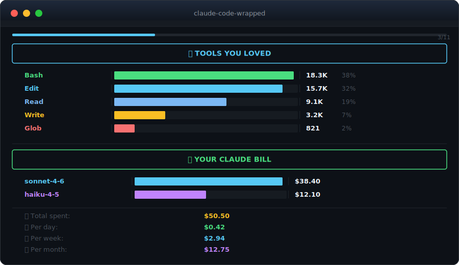

<div align="center">


<br/>

[](https://claude.ai/claude-code)
[](https://python.org)
[](#installation)
[](LICENSE)

**Like Spotify Wrapped, but for your AI coding sessions.**
Type `/wrapped` in Claude Code. Get a full interactive recap of your year.

</div>

---

## What is this?

**Claude Code Wrapped** is a `/wrapped` skill for [Claude Code](https://claude.ai/claude-code) that generates a beautiful, interactive year-in-review of everything you've built with AI.

It reads your local Claude Code session data — no API calls, no uploads, 100% private — and turns it into a **slide-by-slide terminal experience** with charts, stats, and your developer archetype.

<br/>

## Preview

<div align="center">

</div>

<br/>

## The Slides

Each section is its own slide. Press `SPACE` to advance, `Q` to quit.

| Slide | What you see |
|:------|:-------------|
| **Year at a Glance** | Total messages, sessions, tool calls, tokens, first session date |
| **Tools You Loved** | Bar chart of every tool ranked by usage |
| **When You Code** | Hour-by-hour heatmap with your peak coding time |
| **Your Coding Days** | Day-of-week breakdown — are you a weekend warrior? |
| **Legendary Session** | Your longest session ever, with duration and message count |
| **Your AI Fleet** | Model usage split — Haiku vs Sonnet vs Opus |
| **Your Claude Bill** | Estimated cost by model, plus daily / weekly / monthly projections |
| **Files You Couldn't Quit** | Most edited files across all your projects |
| **Go-To Commands** | Your most-used slash commands |
| **Developer Archetype** | The Marathon Runner? The Automator? Find out. |

<br/>

## Installation

**1. Clone and copy the skill:**

```bash
git clone https://github.com/natedemoss/Claude-Code-Wrapped-Skill.git

# macOS / Linux
cp -r Claude-Code-Wrapped-Skill ~/.claude/skills/wrapped

# Windows (PowerShell)
Copy-Item -Recurse Claude-Code-Wrapped-Skill "$env:USERPROFILE\.claude\skills\wrapped"
```

**2. That's it.** No dependencies beyond Python 3.8+. No API keys. No setup.

<br/>

## Usage

Open Claude Code and type:

```
/wrapped
```

An interactive terminal window launches automatically.

| Key | Action |
|:----|:-------|
| `SPACE` or `ENTER` | Next slide |
| `Q` or `ESC` | Quit |

<br/>

## How It Works

Claude Code Wrapped reads three local files that Claude Code maintains automatically:

| File | What it contains |
|:-----|:----------------|
| `~/.claude/stats-cache.json` | Aggregated session stats, token counts, model usage |
| `~/.claude/history.jsonl` | Your slash command history and prompt log |
| `~/.claude/projects/*/` | Raw session JSONL files for tool usage and file stats |

Everything stays on your machine.

### Performance

Results are cached at `~/.claude/wrapped-cache.json`. After the first run, subsequent runs are instant. The cache auto-invalidates whenever you use Claude Code.

| Scenario | Speed |
|:---------|:------|
| First run (no cache) | ~0.1s – 2s depending on session count |
| Cached run | < 0.1s |

<br/>

## Your Developer Archetype

At the end of every wrapped, you get a personality read based on how you actually code:

| Archetype | Trigger |
|:----------|:--------|
| 🏃 **The Marathon Runner** | Sessions lasting 3+ hours |
| 🤖 **The Automator** | Heavy Bash tool usage |
| 🏗️ **The Builder** | High Edit + Write ratio |
| 🦉 **The Night Owl** | Peak coding after 10pm |
| 🌅 **The Early Bird** | Peak coding before 8am |
| 🔄 **The Refactorer** | Edit far outweighs Write |
| 📖 **The Novelist** | Long average prompt length |
| 🎯 **The Minimalist** | Short, punchy prompts |
| 🗺️ **The Explorer** | Heavy Glob + Grep usage |
| ⚡ **The Sprinter** | Many short sessions |
| 👑 **The Delegator** | Heavy Agent tool usage |
| 🌟 **The All-Rounder** | Balanced across everything |

<br/>

## Requirements

- [Claude Code](https://claude.ai/claude-code) installed and used at least once
- Python 3.8+
- A terminal with ANSI color support (virtually all modern terminals)

<br/>

## Platform Notes

**Windows** — launches in a new `cmd` window so the interactive slideshow works correctly.
**macOS / Linux** — runs directly in your terminal.

<br/>

---

<div align="center">

Made for [Claude Code](https://claude.ai/claude-code) by developers who wanted to know how deep the rabbit hole goes.

If this was useful, consider giving a star.

</div>
